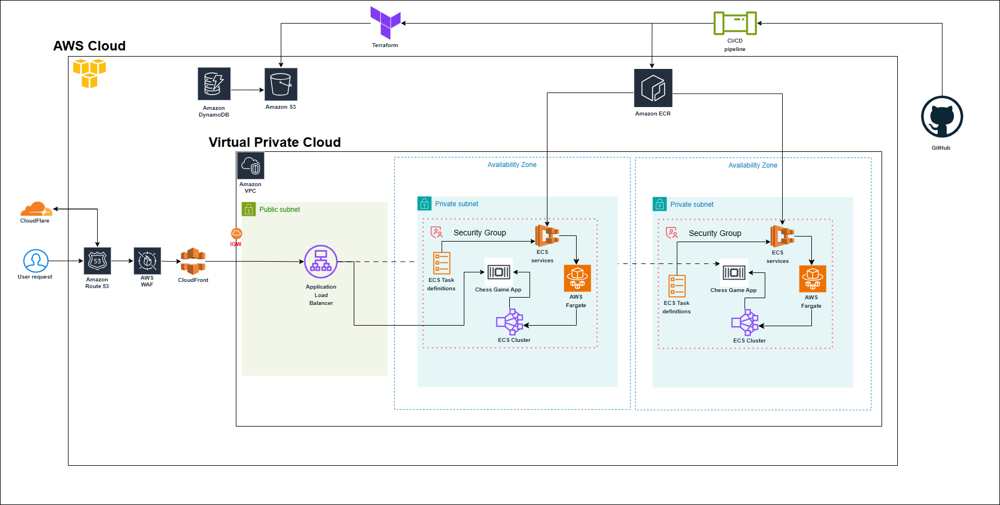

# ECS-powered Chess Intelligence Architecture

## Overview
This document outlines the architecture for the Chess Game application deployed on AWS ECS. The application leverages modern cloud infrastructure to ensure scalability, security, and high availability.

## Architecture Diagram

## Architecture Components

### Frontend and User Interaction
- **CloudFlare**: Manages DNS and provides enhanced performance and security for the application.
- **Amazon Route 53**: Hosts the domain and routes traffic to the application.
- **AWS WAF**: Protects the application against common web exploits and DDoS attacks.
- **Amazon CloudFront**: Acts as a content delivery network (CDN) to improve application performance.

### Load Balancing
- **Application Load Balancer (ALB)**: Distributes incoming traffic to ECS services running in private subnets within the VPC.

### Backend and Application Hosting
- **Amazon ECS (Elastic Container Service)**:
    - **AWS Fargate**: Runs containerized instances of the Chess Game application without managing EC2 instances.
    - **ECS Cluster**: Ensures efficient resource utilization and task scheduling.
    - **ECS Task Definitions**: Define how containers are deployed and managed.

### Data Management
- **Amazon S3**: Stores application assets, logs, and backups.
- **Amazon DynamoDB**: Provides a NoSQL database for storing game-related data.

### Infrastructure as Code (IaC)
- **Terraform**: Provisions and manages the AWS resources in a repeatable and scalable manner.

### CI/CD Pipeline
- **GitHub**: Source code repository and integration with the CI/CD pipeline.
- **CI/CD Pipeline**: Automates application build, testing, and deployment to ECS.

## Key Features
- **High Availability**: Application is deployed across multiple availability zones for fault tolerance.
- **Scalability**: ECS with AWS Fargate allows dynamic scaling of containers based on demand.
- **Security**: WAF, Route 53, and private subnets enhance application and data protection.
- **Performance**: CloudFront ensures low-latency delivery for end-users.

## Network Configuration
- **Public Subnet**: Hosts the ALB, which acts as the entry point for external traffic.
- **Private Subnets**: Host ECS services, ensuring backend resources remain secure.

## How It Works
1. User requests are routed through CloudFlare → Route 53 → WAF → CloudFront → ALB.
2. The ALB forwards traffic to ECS services running in private subnets.
3. ECS services, hosted on AWS Fargate, interact with DynamoDB and S3 to handle application logic and data storage.

## Future Enhancements
- Implement advanced monitoring with Amazon CloudWatch and AWS X-Ray.
- Add auto-scaling policies for ECS services based on application traffic patterns.
- Introduce a staging environment to further streamline the CI/CD pipeline.